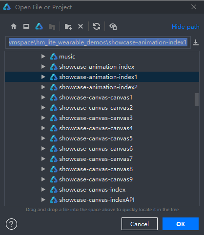
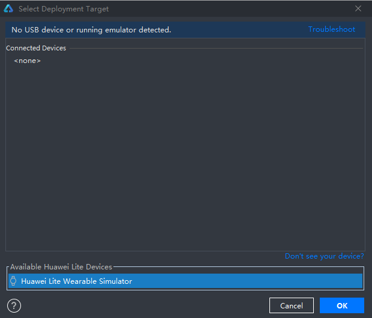
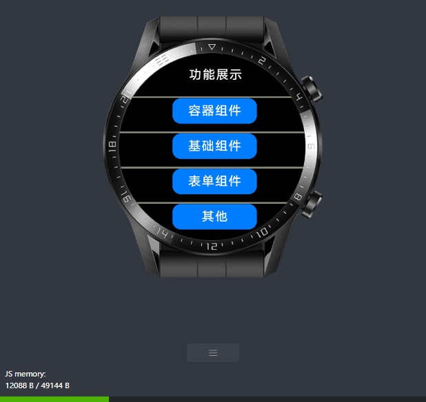
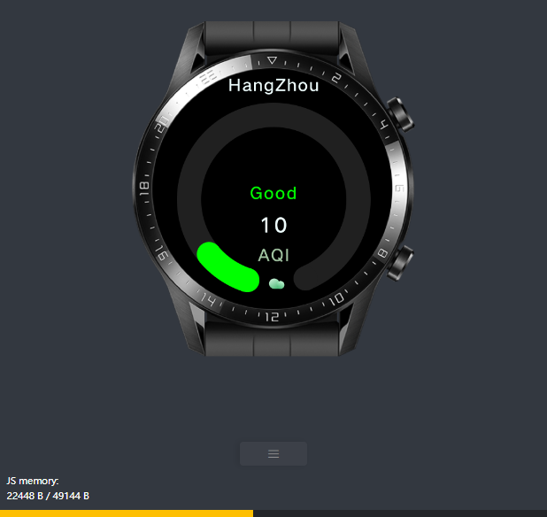
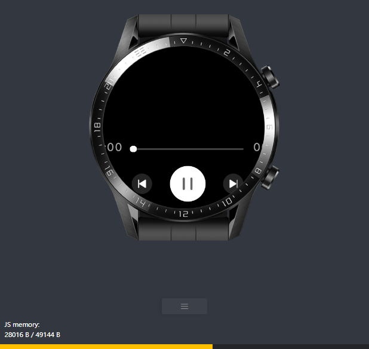
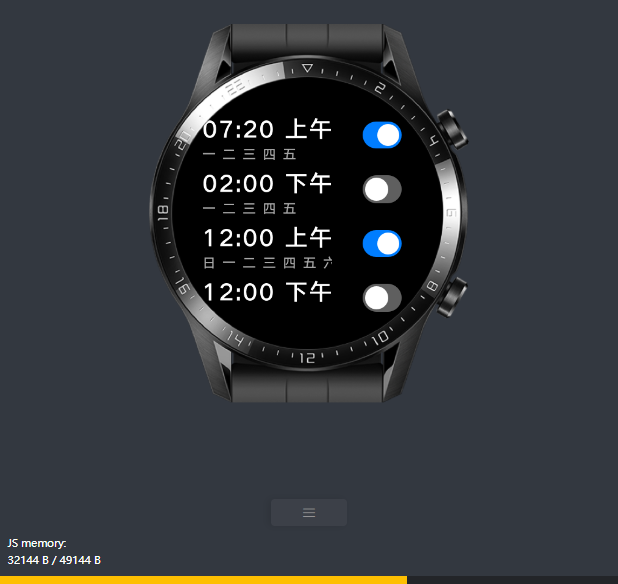
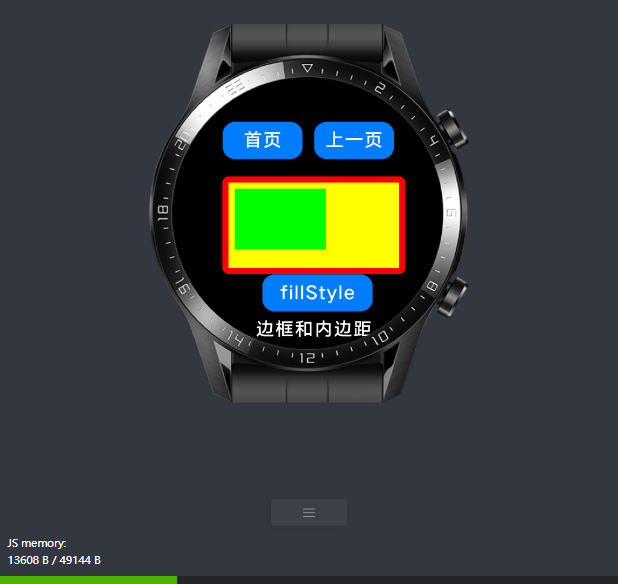

一.项目简介
========================================

本项目是[**`EVM超轻量物联网虚拟机`**](https://gitee.com/scriptiot/evm)团队深入研究鸿蒙智能手表的官方demo后自动化生成的测试用例项目工程，主要用于基于鸿蒙模拟器`体验和学习鸿蒙hml开发智能穿戴应用`；

二.打开项目
========================================

+ 打开 `DevEcoStduio`

+ 点击 `File/Open`

    

+ 点击 `build`

    

+ 选择模拟器 `Huawei Lite Wearable Simulator` 点击OK

    

+ 自动弹出模拟器查看界面效果

    

三、测试展示
========================================

| 例子      |   UI |
| :-------- | --------:|
| **airquality**|  |
| **music**|  |
| **alarm**|  |
| **showcase_index**|  |
| **showcase_canvas_canvas6**|  |

四、加入EVM官方QQ技术交流群
========================================

> 群号：**`399011436`**

五、联系我们
========================================
+ 邮箱： scriptiot@aliyun.com
+ 微信：  
    

欢迎大家通过 `GitHub issues`、`邮件`、 `微信` 或 `QQ群`反馈问题和联系我们。